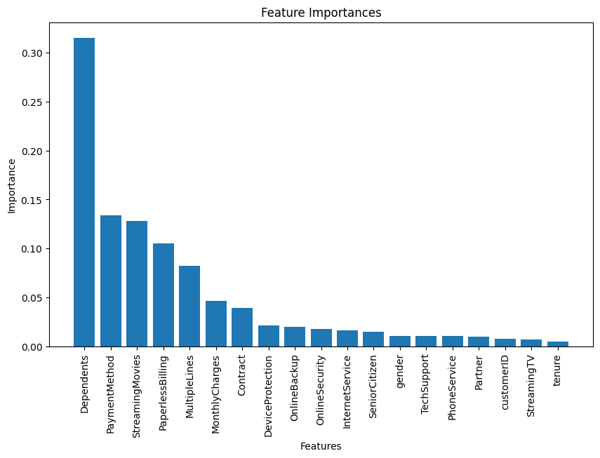
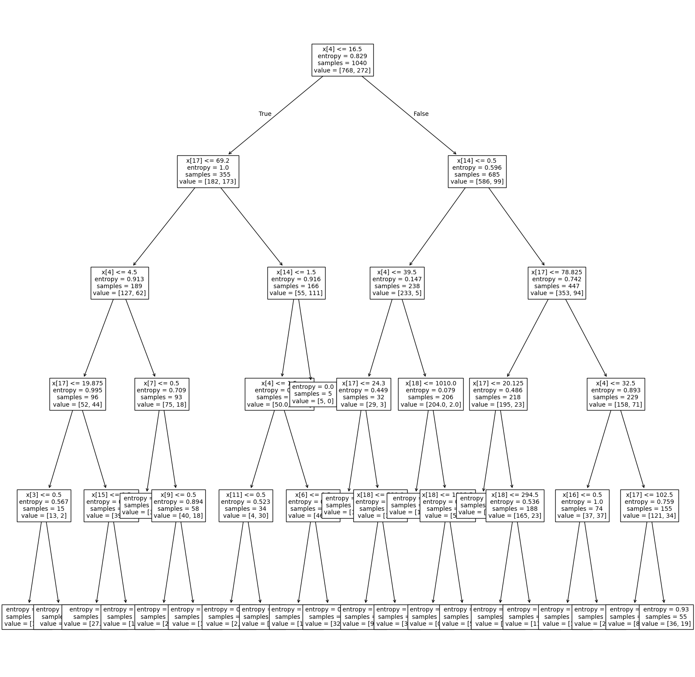
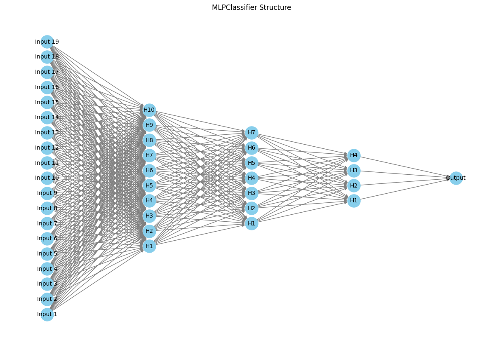
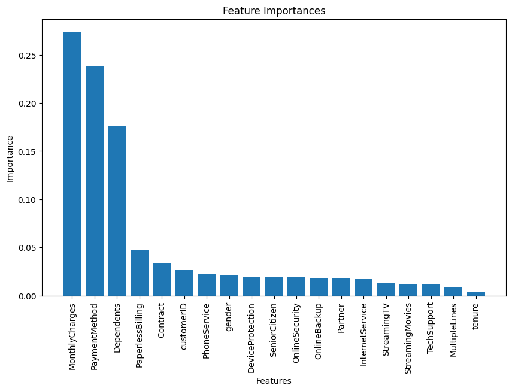
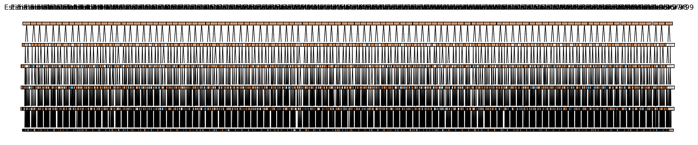

# ML-application

This project is an application developed to predict customer churn using various machine learning models. The dataset consists of customer information and service details, which are processed and analyzed to build predictive models. The app is designed using **PyQt5** for the GUI, allowing users to easily interact with the models and visualize the results.

---

## Project Overview

### Data Preprocessing
The dataset used for this project required extensive cleaning:
- **Data Cleaning**: Extra and incorrect data entries were removed. This included handling missing values and filtering out erroneous data.
- **Feature Transformation**: Non-numeric categorical data were converted into numeric format using a custom function `str_to_int`, which facilitates model training.
- **Grid Search (SVM)**: For the SVM model, a `GridSearchCV` was implemented to find the best hyperparameters, maximizing model accuracy.

### Models Used
The following machine learning models were implemented:
1. **Support Vector Machine (SVM)**: 
   - Hyperparameters were optimized using `GridSearchCV`.
   - Achieved an accuracy of **70%**.
   
2. **Decision Tree**:
   - Built a tree based on Gini Impurity as the splitting criterion.
   - Accuracy: **75%**
   
3. **Neural Network**:
   - A multi-layer perceptron (MLP) neural network was created for prediction.
   - Accuracy: **74%**
   
4. **K-Nearest Neighbors (KNN)**:
   - A standard KNN classifier was trained to classify churn data.
   - Accuracy: **72%**
   
5. **Random Forest**:
   - Utilized an ensemble of decision trees to increase predictive accuracy.
   - Accuracy: **76%**

### Application Interface
The application GUI was developed using **PyQt5**. It provides a user-friendly interface where users can:
- **Upload the Dataset**: Load a CSV file containing customer data.
- **Select Model**: Choose between SVM, Decision Tree, Neural Network, KNN, and Random Forest for churn prediction.
- **Predict & Visualize**: After choosing a model, the app displays the prediction accuracy and shows relevant plots for feature importance and decision boundaries.

### Model Visualizations
Each model’s performance and important features are visualized in the app. Below are example visualizations for each model, along with their accuracy:

1. **SVM**
   - **Accuracy**: 70%
   - 

2. **Decision Tree**
   - **Accuracy**: 75%
   - 

3. **Neural Network**
   - **Accuracy**: 74%
   - 

4. **KNN**
   - **Accuracy**: 72%
   - 

5. **Random Forest**
   - **Accuracy**: 76%
   - 

### How to Use the Application
1. **Upload Data**: Start by uploading a CSV file containing customer information.
2. **Choose a Model**: Select a model from the list (SVM, Decision Tree, Neural Network, KNN, or Random Forest).
3. **View Results**: The app displays the model’s accuracy and relevant visualizations for feature importance and decision boundaries.
4. **Test on New Data**: Users can input test data to predict churn probabilities and further evaluate model performance.

---

## Conclusion
This application provides a comprehensive tool for predicting customer churn using various machine learning techniques. It allows users to preprocess data, select models, and visualize results, making it an ideal tool for businesses to anticipate customer behavior and make informed decisions.

Feel free to explore the project and modify the code for your own use cases. For more details on each model's implementation, refer to the corresponding sections in the code files.
